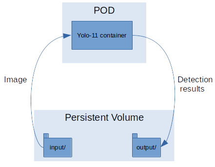
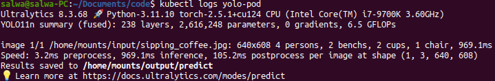
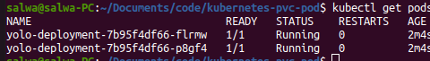

## Kubernetes Persistent Volume in the case of object detection

This project demonstrates the use of a Persistent Volume (PV) and Persistent Volume Claim (PVC) in Kubernetes by creating and managing a single Pod manually. 

The container in the Pod runs YOLOv11 on the image it reads from the volume and stores the output in another directory within the same volume.

The manual Pod creation allows closer observation of the interaction between the Pod, PVC, and PV.

This setup is suitable for testing and learning but may not scale effectively for production use. Consider using a Deployment for managing Pods in production environments.




### Usage
0. If you use docker as driver for Minikube you need to mount your filesytem in the Minikube VM:
```bash
minikube start --driver=docker --mount --mount-string="<path of the this repo in the filesystem of your host machine>:/mnt/data"
```
Example: 
```bash
minikube start --driver=docker --mount --mount-string="/home/salwa/Documents/code/kubernetes-pvc-pod:/mnt/data"
```
In the persistent volume YAML definition file, use /mnt/data as the root for the specified paths, instead of referencing the paths on the host machine (e.g., your laptop).

1. Create the Persistent Volume
```bash
kubectl apply -f pv.yaml
```
2. Create the Persistent Volume Claim
```bash
kubectl apply -f pvc.yaml
```
3. Create the Pod
```bash
kubectl apply -f pod.yaml
```

Once the Pod is created, you should notice the creation of a subfolder in output/ containing an annotated detection image:



### Behaviour with a deployment

The advantage of using a deployment is the automatic management of the pods.
We'll delete the pod (optional step):
```bash
kubectl delete pod yolo-pod
```
Then, create a deployment with of 2 pods:
```bash
kubectl create -f deployment.yaml
```
Now we have 2 identical pods created by the deployment:



### The restartPolicy of the pods
In the pod YAML definition file, we set the pod's restart policy to **Never** for debugging purposes. This way, in case of an issue with the pod, we can log into it (using kubectl exec -it <podname> -- /bin/bash) to investigate. For deployments, the restart policy of the pods can only be **Always**, which means that once a pod finishes, it restarts and runs the inference again. This explains the multiple subfolders predict/ that you'll see in the output/ folder.